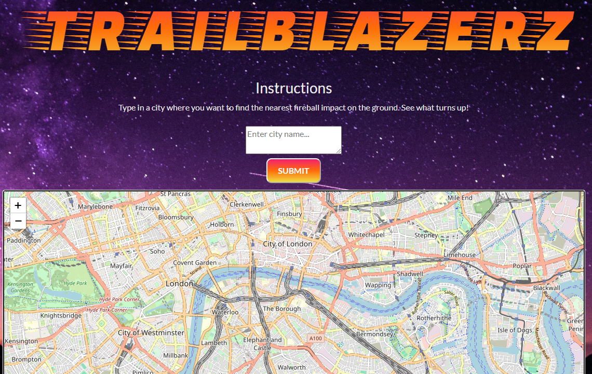

# trailblazerz
## An app that will take a city name, and provide a location on a map of the nearest fireball impact using NASA data

## Screenshots

## URL

[liveURL](https://rachaelkstokes.github.io/trailblazerz/)